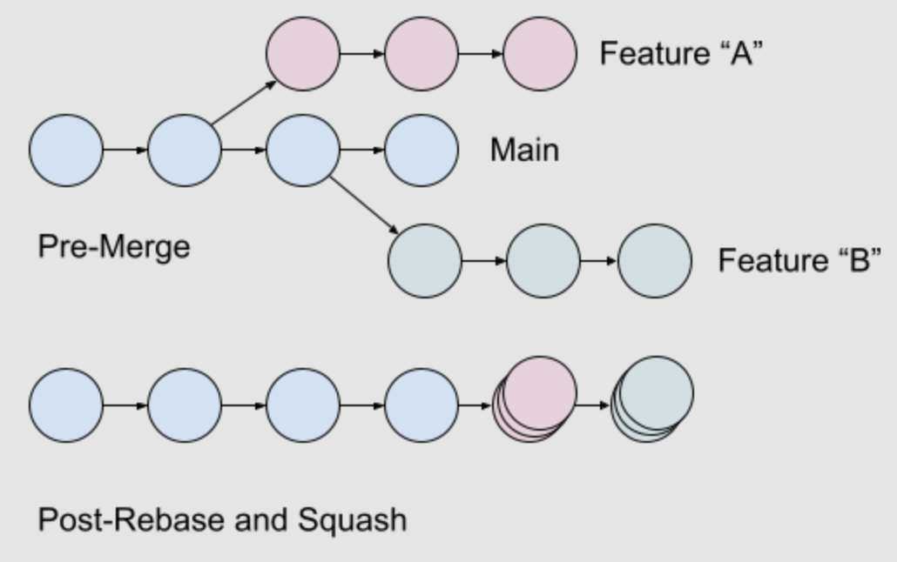
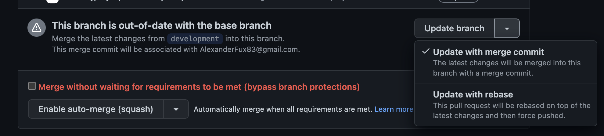

# git-rebase-workshop

# Background

During the development process the code changes relate to each feature are being committed to separate `feature branch`. Due to the fact that the team works on several features in parallel in most cases the default branch's head commit changes since a feature branch created until it is merged.
So, the developer that wants to merge their changes into the default branch first should update the feature branch. There are two main options to do it: merge and rebase.

## Initial state


## After Merge


## After Rebase


## Merging feature branches to the default branch



## Rebasing feature branch on Github


# Rebase Props and Cons
 
- Prop: The PR is tidier and contains only relevant to the work on the feature commits.
- Cons: The conflicts resolution process is more challenging. 
  
> Note: Using merge we need to solve conflicts only once. For rebase we have to do it almost for each commit. If we'd have multiple commits in the branch the rebase could be very hard and painful process. The solution is to keep the branch lean.

# Workshop

## Simple case

1. Create folder for workshop and initialize git

   ```bash
   mkdir workshop
   cd workshop
   git init
   git commit --allow-empty -m "First commit"
   git commit --allow-empty -m "Second commit"
   git commit --allow-empty -m "Third commit"
   git --no-pager log --format=oneline
   ```

2. Create the big feature branch with one commit

    ```bash
    git checkout -b my-big-feature
    touch big-feature-file.txt
    echo Hello > big-feature-file.txt
    git add big-feature-file.txt
    git commit -m "feat: the first big feature commit"
    ```

3. Return to the main branch

   ```bash
   git checkout -
   ```

4. Create the small feature branch with two commits
   
   ```bash
   git checkout -b my-small-feature
   touch small-feature-file.txt
   echo "Hello" > small-feature-file.txt
   git add small-feature-file.txt
   git commit -m "feat: the small feature first commit"
   echo "World" >> small-feature-file.txt
   git add small-feature-file.txt
   git commit -m "feat: the small feature second commit"
   git --no-pager log --format=oneline
   ```

5. Merge it into main branch

   ```bash
   git checkout main
   git merge --squash my-small-feature
   git commit -m "feat: the small feature"
   git branch -D my-small-feature
   git --no-pager log --format=oneline
   ```

6. Find last commit that is common for the feature and the default branch

   ```bash
   git checkout my-big-feature
   echo "Last common commit: " `git merge-base my-big-feature main`
   git --no-pager log --format=oneline
   ```

7. Rebase the big feature branch on main and see that is the last common commit now

   ```bash   
   git rebase main
   echo "Last common commit: " `git merge-base my-big-feature main`
   git --no-pager log --format=oneline
   ```

8. Return to the default branch and delete the `my-big-feature` one

   ```bash
   git checkout -
   git branch -D my-big-feature
   ```

> *Now the last default branch's commit is the last common commit for the feature and the default branches.*

---

## Keeping the branch lean

1. Create new branch

   ```bash
   git checkout -b lean-branch
   ```

2. Add the first commit
   
   ```bash
   touch code.txt
   echo "My feature code" > code.txt
   git add code.txt
   git commit -m "feat: cool feature"
   ```

3. Add the second commit

   ```bash
   touch tests.txt
   echo "My feature tests" > tests.txt
   git add tests.txt
   git commit -m "tests: cool feature"
   git --no-pager log --format=oneline
   ```

4. OMG! You've run tests and figured out that there is a bug. Fix it!

   ```bash
   echo "My feature fixed code" > code.txt
   ```

5. Insert the fix into the first commit so nobody will know we had bugs.

   ```bash
   git add code.txt
   git commit --fixup HEAD~1
   git --no-pager log --format=oneline
   ```

> *Note: You can use the commit sha instead of `HEAD~X`.*

6. Now we need to rebase commits.

   ```bash
   git rebase -i --autosquash HEAD~3
   ```

> Press `ESCAPE` and `:q!` in the vim editor.

7. What do we have now?

   ```bash
   git --no-pager log --format=oneline
   ```

> *Note: If you pushed the changes to the upstream after rebase you have to use `git push --force` to replace fixed commits.*

# Conclusion

Rebase helps to keep the branch both up-to-date and clean, w/o any extraneous commits. 
Using interactive rebase we can fixup every commit in our branch even if there are others on top of it. We can rename and drop commits and even to change the order.


<br />
<center><h1 style="color: green">
Choose REBASE! <br />
Keep your PR tidy!
</h1></center>